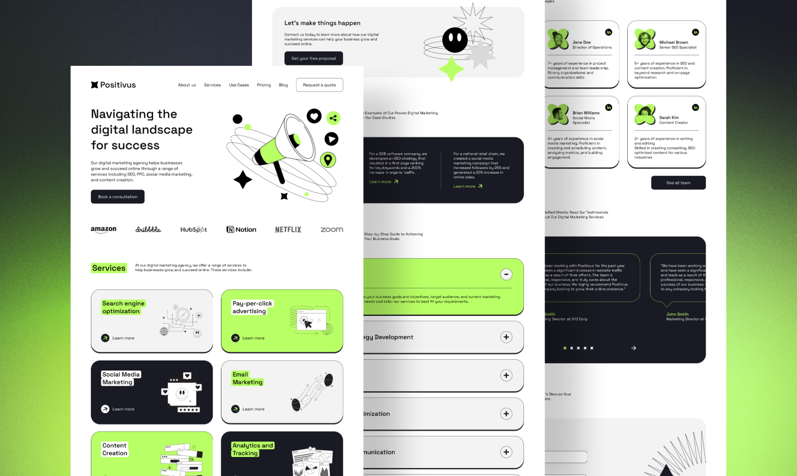

# Positivus

## 📖 Описание проекта

**Positivus** — учебный проект, созданный для практики HTML, CSS и JavaScript на основе дизайн-макета из Figma.

В процессе разработки основной акцент был сделан на:

- семантическую HTML-разметку;
- адаптивную верстку;
- использование современных возможностей CSS;
- организацию проекта по методологии BEM;
- создание переиспользуемых компонентов;
- работу с библиотекой Swiper.js.

Проект разработан исключительно в образовательных целях.

---

## 🎨 Макет

**Figma:** https://www.figma.com/design/ccUGeRqh1VeMPfOAsIIcIo/Positivus-Landing-Page-Design--Community---Copy-?node-id=423-1034&t=M8OGuxxdcNz5ffXd-0

**Демо проекта:** https://positivus-ecru.vercel.app/

Макет использовался как основной источник для реализации интерфейса, включая сетку, типографику, отступы и цветовую палитру.

---

## 🛠 Используемые технологии

### Стек проекта

- HTML5
- CSS3
    - Flexbox
    - CSS Grid
    - CSS Variables
    - Media Queries
- JavaScript (ES6+)
- Swiper.js
- Git
- GitHub

---

## ✨ Реализованный функционал

- 📱 Адаптивная верстка для Desktop, Tablet и Mobile устройств
- 🍔 Мобильное бургер-меню
- 🎞 Бесконечный слайдер логотипов на Swiper.js
- 🧩 Компонентный подход к разработке
- 🎯 Максимальное соответствие дизайн-макету
- 🖼 Декоративные изображения и SVG-графика
- ⚡ Оптимизированная структура CSS и JavaScript

---

## 📂 Структура проекта

```text
Positivus/
│
├── css/
│   ├── variables.css
│   ├── base.css
│   ├── header.css
│   ├── hero.css
│   ├── services.css
│   ├── media.css
│   └── style.css
│
├── image/
│
├── icon/
│
├── scripts/
│   ├── burger-menu.js
│   ├── swiper.js
│   └── index.js
│
├── index.html
│
└── README.md
```

---

## 🚀 Как запустить проект

### Способ 1. Локальный запуск

Клонировать репозиторий:

```bash
git clone https://github.com/USERNAME/positivus.git
```

Перейти в папку проекта:

```bash
cd positivus
```

Открыть файл:

```text
index.html
```

в браузере.

---

### Способ 2. Через Live Server

1. Установить расширение **Live Server** для VS Code.
2. Открыть проект в редакторе.
3. Нажать правой кнопкой мыши по `index.html`.
4. Выбрать:

```text
Open with Live Server
```

---

## 📚 Что было изучено в проекте

В ходе разработки были закреплены навыки:

- семантической верстки;
- работы с Flexbox и CSS Grid;
- адаптивной разработки;
- организации CSS по БЭМ;
- использования CSS-переменных;
- подключения сторонних библиотек;
- создания мобильной навигации;
- работы с Git и GitHub.


